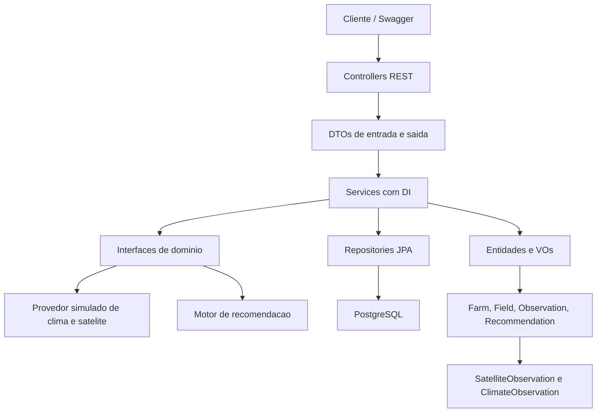

# Gaia Backend MVP

API REST para monitoramento agricola e recomendacoes acionaveis do Gaia, uma plataforma de inteligencia agricola baseada em observacao espacial.

## Motivacao

Produtores rurais precisam transformar informacoes ambientais em decisoes simples. O Gaia interpreta observacoes espaciais e climaticas para responder duas perguntas:

- O que esta acontecendo no talhao?
- O que merece atencao agora?

Este backend foi construido para a Global Solution como um Web Service com POO, DTOs, VOs, banco de dados, heranca, polimorfismo, interfaces, injecao de dependencia e tratamento de excecoes.

## Tecnologias

- Java 21
- Spring Boot 3
- Spring Web
- Spring Data JPA
- PostgreSQL via Docker Compose
- Swagger/OpenAPI
- Maven
- JUnit 5

## Como rodar

Suba o banco:

```bash
docker compose up -d
```

Rode a API:

```bash
mvn spring-boot:run
```

Acesse:

- API: http://localhost:8080
- Swagger: http://localhost:8080/swagger-ui.html
- Health check: http://localhost:8080/actuator/health

## Endpoints principais

| Metodo | Endpoint | Descricao |
| --- | --- | --- |
| `GET` | `/farms` | Lista propriedades |
| `POST` | `/farms` | Cria propriedade |
| `PUT` | `/farms/{id}` | Atualiza propriedade |
| `DELETE` | `/farms/{id}` | Remove propriedade |
| `GET` | `/fields` | Lista talhoes |
| `POST` | `/fields` | Cria talhao |
| `PUT` | `/fields/{id}` | Atualiza talhao |
| `DELETE` | `/fields/{id}` | Remove talhao |
| `GET` | `/observations` | Lista observacoes |
| `POST` | `/observations` | Gera observacao simulada |
| `GET` | `/fields/{fieldId}/observations` | Lista historico do talhao |
| `POST` | `/recommendations/generate?fieldId={id}` | Gera recomendacao |
| `GET` | `/fields/{fieldId}/recommendations` | Lista recomendacoes do talhao |

## Exemplos de requisicao

Criar propriedade:

```json
{
  "name": "Fazenda Primavera",
  "ownerName": "Marina Silva",
  "city": "Campinas",
  "state": "SP"
}
```

Criar talhao:

```json
{
  "name": "Talhao Leste",
  "crop": "Cafe",
  "hectares": 18.5,
  "latitude": -22.90,
  "longitude": -47.06,
  "farmId": 1
}
```

Gerar observacao:

```json
{
  "fieldId": 1,
  "type": "SATELLITE",
  "observedAt": "2026-06-05T10:00:00Z"
}
```

## Fluxo da arquitetura



## Evidencias de execucao

Testes automatizados executados com sucesso:

```text
mvn test
Tests run: 6, Failures: 0, Errors: 0, Skipped: 0
BUILD SUCCESS
```

O seed inicial cria uma fazenda, dois talhoes, observacoes climaticas/satelitais e recomendacoes para demonstrar o fluxo completo ao subir a API.

## Requisitos atendidos

- Modelagem de dominio com classes publicas.
- Heranca e polimorfismo com `Observation`, `SatelliteObservation` e `ClimateObservation`.
- Interfaces e injecao de dependencia com services e providers.
- DTOs para entrada e saida da API.
- VOs para coordenada, area, indice de vegetacao e risco.
- Persistencia com PostgreSQL.
- Web Service REST com Swagger.
- Tratamento global de excecoes.
- Manipulacao de datas com `OffsetDateTime`.
- README com motivacao, arquitetura e evidencias.
