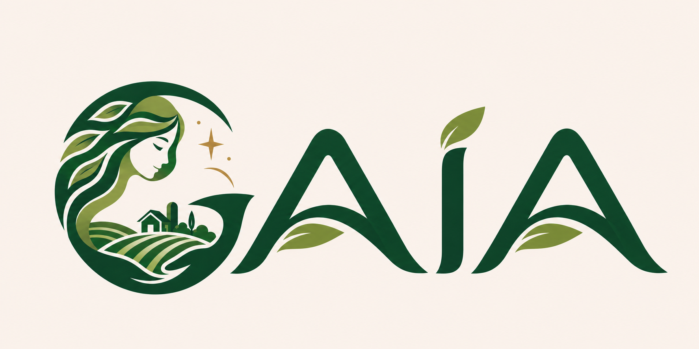
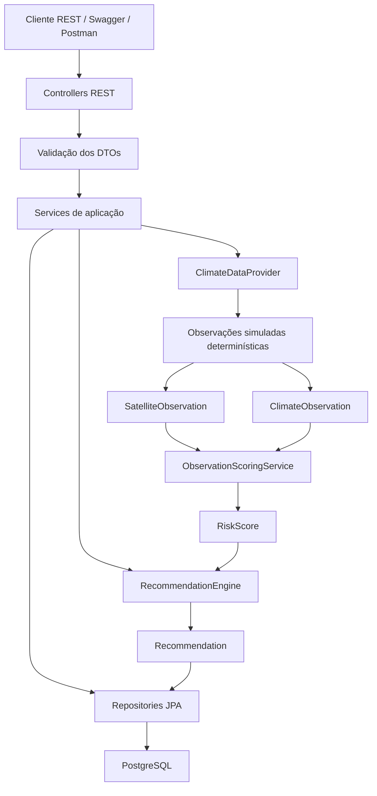
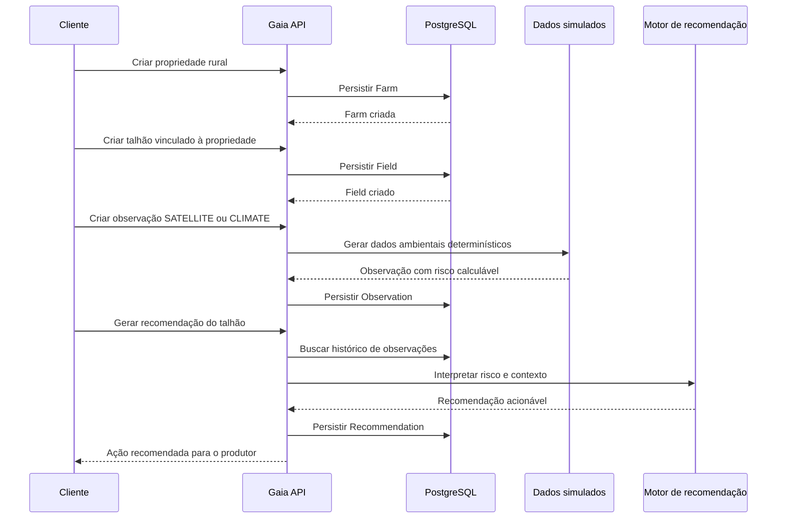

<p align="center">
  
</p>

<p align="center">
  
  
  
  
  
  
</p>

# Gaia Backend MVP

API REST para monitoramento agrícola e recomendações acionáveis do Gaia, uma plataforma de inteligência agrícola baseada em observação espacial.

## Integrantes

| Nome | RM |
|---|---|
| Leonardo Correa de Mello | RM 555573 |
| Felipe Soares Xavier | RM 556931 |
| Pedro Visconti Guidotte | RM 556630 |
| Herbert de Sousa Vilela | RM 555701 |
| Gabriel Figueira Flora | RM 556476 |

## Motivação do projeto

Decisões agrícolas dependem de informações ambientais confiáveis: condição da vegetação, comportamento climático, riscos próximos à propriedade e evolução do talhão ao longo do tempo. O problema é que esses dados costumam ficar espalhados em sistemas diferentes, com linguagem técnica e baixa orientação para a tomada de decisão do produtor.

O Gaia foi pensado para resolver esse ponto: transformar observações espaciais e ambientais em entendimento prático. A proposta não é criar apenas um painel com números brutos, nem uma aplicação de clima genérica. O objetivo é interpretar sinais relevantes e responder, de forma simples, duas perguntas centrais:

- O que está acontecendo na propriedade ou no talhão?
- O que merece atenção e qual ação deve ser priorizada?

Este backend representa o primeiro recorte técnico dessa visão. Ele modela propriedades rurais, talhões, observações satelitais, observações climáticas e recomendações agrícolas. A API usa dados simulados de forma determinística para demonstrar o fluxo completo sem depender de serviços externos, mantendo a entrega simples de executar e fácil de avaliar.

O foco estratégico do MVP é **monitoramento da saúde da vegetação e apoio à decisão por meio de observação espacial**. Por isso, a API não expõe apenas dados técnicos como NDVI ou chuva acumulada: ela também gera mensagens e recomendações em linguagem compreensível para produtores, como inspeção de vegetação, acompanhamento do talhão ou avaliação de irrigação.

## Arquitetura e fluxo

A arquitetura segue uma separação em camadas para demonstrar organização, testabilidade e desacoplamento:

- **Controllers REST** recebem as requisições HTTP e expõem os recursos da API.
- **DTOs** separam o contrato externo da API das entidades persistidas.
- **Services** concentram regras de aplicação, orquestração do fluxo e injeção de dependências.
- **Interfaces de domínio** definem contratos para pontuação de risco, geração de recomendações e fornecimento de dados simulados.
- **Entidades JPA** representam o modelo persistido no PostgreSQL.
- **Value Objects** encapsulam conceitos de domínio como coordenada, área, índice de vegetação e pontuação de risco.
- **Repositories JPA** cuidam da persistência sem expor detalhes de banco para a API.

O modelo de domínio foi estruturado para evidenciar conceitos de POO:

- `Observation` é uma classe abstrata para observações ambientais.
- `SatelliteObservation` e `ClimateObservation` especializam a observação por herança.
- O método `producerMessage()` é polimórfico e gera mensagens específicas para cada tipo de observação.
- `RecommendationEngine`, `ObservationScoringService` e `ClimateDataProvider` são interfaces injetadas por dependência.

### Fluxo funcional



### Fluxo de uso esperado



### Recursos da API

| Recurso | Responsabilidade |
|---|---|
| `/farms` | Cadastro e manutenção de propriedades rurais. |
| `/fields` | Cadastro e manutenção de talhões vinculados a propriedades. |
| `/observations` | Registro de observações satelitais e climáticas simuladas. |
| `/fields/{fieldId}/observations` | Consulta do histórico ambiental de um talhão. |
| `/recommendations/generate` | Geração de recomendação agrícola a partir das observações. |
| `/fields/{fieldId}/recommendations` | Consulta de recomendações já geradas para um talhão. |

## Como rodar

Pré-requisitos:

- Java 21
- Maven 3
- Docker Desktop

Suba o banco PostgreSQL:

```bash
docker compose up -d
```

Rode a API:

```bash
mvn spring-boot:run
```

Acesse:

- API: http://localhost:8080
- Swagger: http://localhost:8080/swagger-ui.html
- Health check: http://localhost:8080/actuator/health

Execute os testes automatizados:

```bash
mvn test
```

Também há uma coleção Postman no arquivo `gaia-api.postman_collection.json`, com uma sequência pronta para testar o fluxo completo da API.
